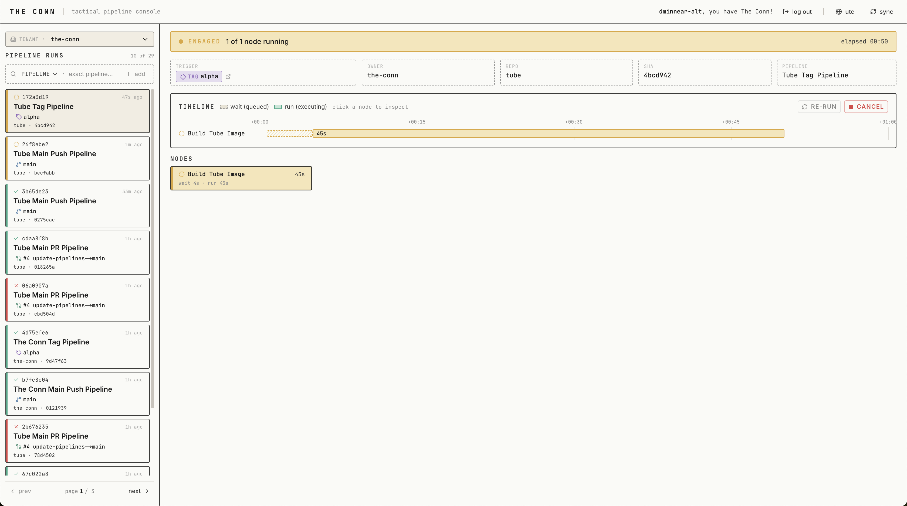
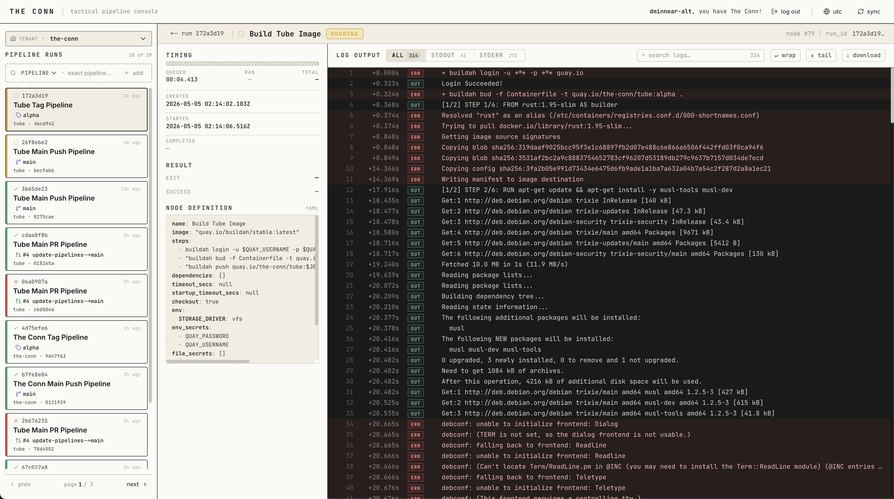

# The Conn: Tactical Pipeline Console

**The Conn** is a reactive, distributed CI/CD framework for OpenShift and Kubernetes. This repository contains its frontend — the tactical pipeline console: a high-density, retro-futuristic naval bridge for watching pipeline runs in real time across multiple tenants. The platform's backend, [Jefferies](https://github.com/the-conn/jefferies), handles orchestration, state, and execution; this UI is the surface that operators, developers, and on-call engineers actually look at when a build is running.

The names trace a Star Trek lineage — the **conn** is the bridge station from which a starship is steered, and **Jefferies tubes** are the maintenance crawlspaces that keep it running. The aesthetic leans into that vocabulary on purpose.

---

## **Screenshots**

**Pipeline view** — sidebar of recent runs, run metadata, status banner, Gantt timeline of node execution, and the node summary grid. Captured from the dogfooded `the-conn` tenant in production.



**Node view** — per-node timing breakdown, raw YAML node definition, and the virtualized log pane with stdout/stderr stream filters and line numbers.



---

## **Core Tech Stack**

* **Framework:** Next.js 16 (App Router, standalone output) on React 19
* **Language:** TypeScript in strict mode
* **State & Fetching:** TanStack Query v5 (with devtools)
* **Styling:** Tailwind CSS v4 + Linaria (zero-runtime CSS-in-JS)
* **Icons:** `lucide-react`
* **Virtualization:** `react-virtuoso` for the log viewer

The frontend is fully stateless — every piece of run, node, and session data is owned by the backend. The UI is a thin, reactive view over the Jefferies HTTP API.

---

## **Design Identity**

The Conn is meant to feel like a piece of equipment, not a web app. The design vocabulary is small and consistent.

* **Palette:** A muted cream `paper` surface against a dark `ink` foreground, with status-coded accents (`emerald-conn` for pass, `rose-conn` for fail, `amber-conn` for running, `slate-conn` for cancelled). Each status color has a soft variant used for fills and a solid variant used for borders and text.
* **Typography:** Sans-serif (Inter) for prose and UI labels; JetBrains Mono for SHAs, run IDs, timestamps, log output, and any value that should read as data rather than language.
* **Timeline language:** Dashed borders on Gantt segments are *startup* — the gap between an execution node being scheduled (a Kubernetes Job is created) and the node setting its `started_at`, when the container is up and the runtime wrapper has taken over. Solid fills are pipeline node execution itself, which spans workspace pull, environment setup, and the user's script. A row that goes dashed → solid is a node that has just begun executing.
* **Status banners:** Run state drives a single uppercase wordmark at the top of the deck — `ENGAGED`, `RED ALERT`, `ALL SYSTEMS OPERATIONAL`, or `DECOMMISSIONED`. The banner is the first thing your eye lands on; everything else is detail.

---

## **Application Surface**

The two screenshots above are the two primary views. Here is what each component is doing.

### **1. Tenant switcher and run sidebar**
A 296px rail pinned to the left of every page. The switcher at the top selects which tenant is active (a user can be authorized for more than one). The sidebar lists the most recent runs for that tenant — pipeline name, branch / tag / PR chip, short SHA, and relative age. Pagination is chevron-based; the page size is configurable per deployment.

### **2. Filter bar**
Above the run list. Filters by `pipeline_name`, `repo`, and `sha`. Filter state is persisted to the URL so links survive navigation, browser back/forward, and reload.

### **3. Sync button**
A manual refresh in the header. It invalidates the run-list query without disturbing the open run detail or its nodes — useful immediately after triggering a pipeline from elsewhere.

### **4. Run detail (Execution Deck)**
The main canvas. From top to bottom:
* **Status banner** with the run's wordmark and `N of M nodes running`.
* **Metadata grid** — trigger, owner, repo, short SHA, pipeline name.
* **Timeline** — a horizontal Gantt with one row per node. Each row shows the wait segment and the run segment. Click a node to jump into its detail view. `RE-RUN` and `CANCEL` actions live on the timeline header.
* **Node grid** — a flat list of every node in the pipeline with status glyphs, useful when the timeline is dense.

### **5. Node detail**
Selecting a node from the timeline or grid swaps the right-hand pane:
* **Timing breakdown** — queue wait vs. runtime, with elapsed-time gutters that match the timeline.
* **Result** — final outcome and any structured failure reason surfaced by the backend's pod watcher (`ImagePullBackOff`, `OOMKilled`, `PodStartTimeout`, etc.).
* **Node definition** — the literal YAML for this node from the pipeline file, rendered in monospace exactly as authored.
* **Log viewer** — see below.

### **6. Log viewer**
The largest panel on the node view. It is virtualized via `react-virtuoso` so multi-thousand-line outputs scroll without re-rendering. Features:
* Stream filter — `ALL`, `STDOUT`, or `STDERR`.
* Line numbers and an elapsed-time gutter aligned to the run's start.
* Inline search and a wrap toggle.
* Raw download for offline inspection.
* `stderr` lines are tinted so failures jump out without needing to filter.

---

## **Data Fetching and Polling**

All data flows through TanStack Query. Cadence rules — designed against the Jefferies backend's own scaling characteristics:

* **5s background poll** on the sidebar, run detail, and nodes endpoint while a run is in progress. Freshness wins; the backend is built to handle the load.
* **60s slow poll** once every node has settled (every `success` is non-null and the run is terminal).
* **Each query derives its own cadence from its own data.** Polling cadence is never passed between queries via flags — that would let a slower query stall on stale data after a sibling query has already observed the terminal transition.
* **Known transitions force an immediate refetch.** When `run.status` flips from `in_progress` to a terminal state, dependent queries (nodes, logs) are invalidated immediately rather than waiting for the next tick.

The URL is the source of truth. The active run is `/{slug}/runs/{run_id}`; the active tenant is `/{slug}/...`. Nothing about the current view lives in global state if it can live in the path.

---

## **Authentication and Multi-Tenancy**

The frontend never sees credentials. Authentication is a chain — the frontend hands off to the backend, the backend acts as an OIDC client to Dex, and Dex authenticates the user through whichever connector(s) the deployment has configured. The frontend has no awareness of which identity providers are in use; that decision lives entirely in Dex's configuration.

1. The Next.js middleware checks for the `jefferies_session` cookie. If absent, it redirects the browser to `{API_BASE}/api/auth/login?return_to={path}`.
2. The backend kicks off the OIDC handshake with Dex; Dex authenticates the user against its configured connector and redirects back through the backend's callback. The backend sets the session cookie and 302s the browser to the original URL.
3. The UI calls `GET /api/auth/me` to learn `authorized_slugs` and `active_tenant_context`. The home route auto-redirects into `/{active_slug}/runs`.
4. Every tenant-scoped page is wrapped in a `TenantGate` that returns 404 if the URL slug is not in `authorized_slugs` — defense-in-depth against an old link or a typed-in URL.
5. The `TenantSwitcher` calls `POST /api/auth/active-tenant` and rehydrates the relevant queries.

A user with no authorized tenants gets the backend's `403 no_authorized_tenants` and stays on the login flow — there is no half-authenticated shell.

---

## **Project Structure**

```
src/
├── app/         # App Router pages: root redirect, [slug]/runs/[run_id]/...,
│                # health/live, health/ready, providers, middleware
├── components/  # layout/ (shell, sidebar, top nav), runs/ (Execution Deck,
│                # Gantt, log viewer, node panels), ui/ (atomic primitives)
├── hooks/       # useRuns, useRun, useRunNodes, useNodeDetail, useNodeLogs,
│                # useTenantSlug, useFormatTime
├── services/    # apiClient, runs, session, queryKeys
├── types/       # api.ts (Run, NodeExecution, NodeDefinition, LogLine), ui.ts
└── utils/       # time and format helpers
```

The `components/ui/` directory holds atomic primitives (`Button`, `StatusGlyph`, `StatusPill`, `Mono`, `TriggerChip`, `SearchBox`, `StreamFilter`). They have no business logic — feature components in `components/runs/` and `components/layout/` compose them.

---

## **Configuration**

Three runtime environment variables are consumed at build and runtime, all prefixed `NEXT_PUBLIC_` because they are read in the browser:

```bash
NEXT_PUBLIC_API_BASE_URL=http://localhost:8080  # Jefferies backend root
NEXT_PUBLIC_SIDEBAR_LIMIT=10                    # runs per sidebar page
NEXT_PUBLIC_GIT_BASE_URL=https://github.com     # used for commit / PR deep links
```

The API base must be reachable from the browser. There is no Next-side proxy — every API call goes directly from the user's browser to the Jefferies backend with `credentials: include` so the session cookie travels.

In production deployments the frontend and backend share an origin: `the-conn.com` serves the frontend, and `the-conn.com/api/*` is routed by the cluster ingress to Jefferies. The frontend deliberately reserves no `/api/*` routes of its own — every `/api/...` path the UI calls is owned by the backend. Same-origin routing is what lets the session cookie flow without CORS configuration; in production `NEXT_PUBLIC_API_BASE_URL` is the public origin (e.g. `https://the-conn.com`), and locally it points directly at the backend's port (e.g. `http://localhost:8080`).

---

## **Development**

The `Makefile` is the canonical interface. All targets are short and listed by `make help`.

| Target | What it does |
| --- | --- |
| `make install` | `npm install` |
| `make dev` | Next.js dev server with hot reload |
| `make build` | Production bundle (`.next/standalone`) |
| `make start` | Serve the production bundle locally |
| `make check` | The CI gate: Prettier `format:check`, ESLint, `tsc --noEmit`, in that order |
| `make fmt` | Format the codebase with Prettier |
| `make image` | Build the multi-stage container image |
| `make push` | Push the image to the configured registry |
| `make image-run` | Run the built image locally on `:8080` with env vars wired |

Run `make check` after edits — do not invoke `tsc` directly. If `format:check` fails, `make fmt` will fix it.

---

## **Deployment**

The container image is a multi-stage Node 24 build that bakes in the standalone Next output and serves on port `8080` as an unprivileged user. Two probe endpoints are exposed for Kubernetes:

* `GET /health/live` — process is up.
* `GET /health/ready` — process is ready to receive traffic.

The frontend is fully stateless. All session, run, and tenant state lives in the backend's Redis and Postgres. Scale horizontally behind any load balancer; rolling updates and pod failures are non-events for the UI.
